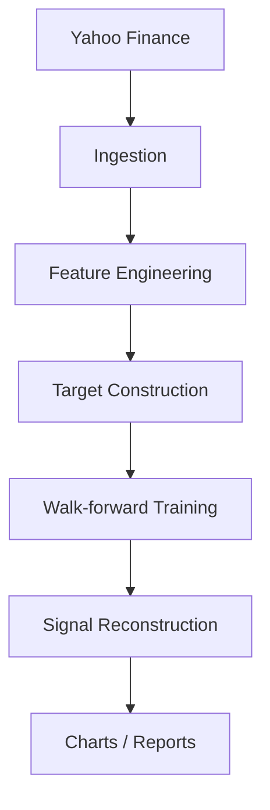
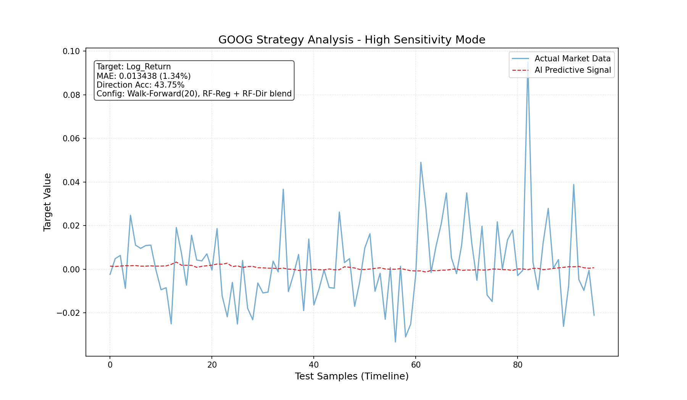
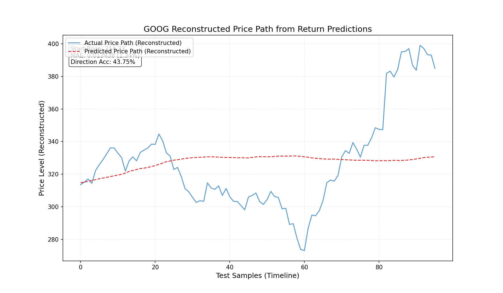
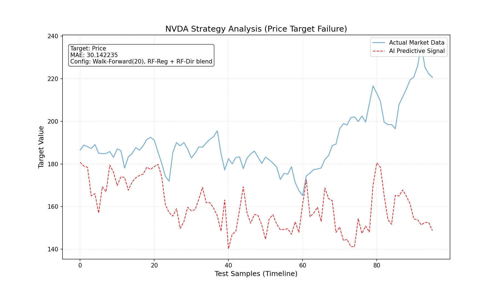

# Stationarity-Aware Market Modeling


[](LICENSE)

A stationarity-aware ML framework for stress-testing financial time-series models under volatile market regimes.

This project demonstrates how target design and feature engineering can dramatically improve model stability when prices trend strongly.

## Table of Contents

- [Highlights](#highlights)
- [Why This Project](#why-this-project)
- [Architecture](#architecture)
- [Quick Demo](#quick-demo)
- [Results](#results)
- [Example Output](#example-output)
- [Failure Case](#failure-case)
- [Key Learnings](#key-learnings)
- [Advanced Toolkit](#advanced-toolkit)
- [Limitations](#limitations)
- [Developer Docs](#developer-docs)

## Highlights

- Built a modular 4-stage ML workflow: ingestion -> diagnostics -> feature engineering -> training/profiling
- Improved prediction behavior by shifting from absolute price targets to return-based targets
- Added pipeline safeguards for feature mismatch and missing column scenarios
- Produces reproducible artifacts (`data/*.csv`, `reports/chart_*.png`) — see **Example Output** for committed GOOG charts

## Why This Project

Traditional regressors on raw prices often degrade when asset scales drift over time (e.g., large rallies).  
This repo focuses on **stationarity-aware modeling**:

- `Price` target for baseline
- `Simple_Return` and `Log_Return` for scale-invariant targets
- Technical and volatility features to better capture regime shifts

## Tech Stack

- Python 3.10+ (`pandas`, `numpy`, `scikit-learn`, `yfinance`, `matplotlib`, `psutil`)
- Dependencies: [`pyproject.toml`](pyproject.toml) · [`requirements.txt`](requirements.txt)
- Model: `RandomForestRegressor`
- Evaluation: Time-ordered split + MAE + visual signal comparison

## Architecture

End-to-end pipeline from market data to reproducible artifacts:



| Stage | Script | Output |
|-------|--------|--------|
| Ingestion | `src/1_get_real_data.py` | `data/<ticker>_assets.csv` |
| Feature Engineering | `src/3_feature_engineering.py` | Indicators (MA, RSI, volatility, …) |
| Target Construction | `src/3_feature_engineering.py` | `Target` column (`Price`, `Log_Return`, `Simple_Return`) |
| Walk-forward Training | `src/4_train_model.py` | MAE, direction accuracy, latency/memory |
| Signal Reconstruction | `src/4_train_model.py` | Return → price path for charts |
| Charts / Reports | `src/4_train_model.py`, `benchmark.py` | `reports/chart_*.png`, `performance_report_*.json` |

Optional profiling between ingestion and features: `src/2_explore_data.py`.

## Quick Demo

From the repo root:

```bash
python -m venv .venv
source .venv/bin/activate   # Windows: .venv\Scripts\activate
pip install ".[dev]"                # or: pip install -r requirements.txt

python src/1_get_real_data.py GOOG
python src/3_feature_engineering.py GOOG
python src/4_train_model.py GOOG
```

After running:

- Processed dataset is written to the path in `src/configs.json`
- Charts are saved under `reports/` (see **Example Output** for sample GOOG figures)

Full multi-ticker benchmark:

```bash
python benchmark.py
```

## Results

<!-- RESULTS:START -->
Measured on four high-volatility tickers (`AVGO`, `GOOG`, `MU`, `NVDA`) with Yahoo Finance data through **2026-05-19** (~480 samples each after feature warmup).  
*Metrics last refreshed: 2026-05-21 09:52 via `python scripts/refresh_readme_metrics.py`.*

| Ticker | Baseline target | Baseline MAE (price units) | Optimized target | Optimized MAE | Direction accuracy |
|--------|-----------------|----------------------------|------------------|---------------|----------------------|
| AVGO | `Price` | 20.34 | `Log_Return` | **1.98%** | 55.2% |
| GOOG | `Price` | 23.10 | `Log_Return` | **1.34%** | 41.7% |
| MU | `Price` | 85.29 | `Log_Return` | **3.86%** | 54.2% |
| NVDA | `Price` | 30.14 | `Simple_Return` | **1.78%** | 46.9% |
<!-- RESULTS:END -->

**Evaluation protocol** (production RF path in `src/4_train_model.py`)

- 80/20 chronological split (no shuffle)
- Walk-forward inference with retrain every 20 test steps
- Return targets use the production blend: RF regressor + direction classifier + recent drift anchoring (see `src/4_train_model.py`)

### Before vs after (target redesign)

See table above. Refresh after new data:

```bash
python scripts/refresh_readme_metrics.py
```

Price-target MAE is in **dollar scale** and grows with share price (e.g., MU baseline ~$85 vs GOOG ~$23), so it is not comparable across tickers or over long rallies. Return-target MAE is reported as **percent of daily move**, which stays scale-invariant and matches the stress-test goal.

**What improved in practice**

- Return targets keep error metrics in a stable range (roughly **1.3%–3.9%** daily MAE) instead of price-scale drift.
- Charts export both **signal** and **reconstructed price path** views so uptrends are visible instead of a flat counter-trend baseline.
- Pipeline latency stays low on laptop hardware (~**1.4–1.5s** train per ticker, ~**65–71 MB** memory delta).

### Reproduce these numbers

```bash
# Full multi-ticker run (download + features + train + report JSON)
python benchmark.py

# Side-by-side Price vs optimized target on existing local CSVs
python scripts/compare_targets.py

# Update README Results table (<!-- RESULTS:START/END --> markers)
python scripts/refresh_readme_metrics.py
```

Artifacts land in `reports/` (`chart_<TICKER>_<timestamp>.png`, `performance_report_*.json`). Raw/processed CSV paths are gitignored; run ingestion once before `compare_targets.py`.

## Example Output

GOOG (`Log_Return` target) — walk-forward test split, data through **2026-05-19**. Blue = actual market signal; red dashed = model prediction. Overlay shows **MAE 1.34%** and direction accuracy.



Same run, returns compounded back to price levels so trend alignment is easy to read (not visible on raw return scale alone):



Regenerate after **Quick Demo** (writes timestamped files under `reports/`).

## Failure Case

Not every setup worked. The clearest failure mode showed up when keeping **raw `Price` targets** through strong rallies (especially **NVDA** and high-beta semis).

**What failed**

- During NVDA’s uptrend-heavy test window, the price-target regressor **underfit directional momentum** — predictions lagged actual moves and often looked like a smoothed, counter-trend line instead of following the rally.
- Dollar-scale MAE ballooned to **~$30 per day** on NVDA (and **~$85** on MU at a higher price level), which reflects scale drift more than a meaningful error rate across tickers or regimes.
- Directional accuracy stayed near coin-flip; the model was optimizing the wrong stationary object (absolute level) while the market was moving in **return space**.

**Why it failed**

Tree models interpolate well locally but **extrapolate poorly** when the target mean shifts with price level. A rally pushes tomorrow’s price distribution far outside the training range, so the regressor defaults to recent-level smoothing rather than return dynamics.

**What we changed**

- Switched production targets to **`Simple_Return` (NVDA)** and **`Log_Return` (AVGO, GOOG, MU)** with walk-forward retraining and return-space direction blending.
- NVDA optimized MAE dropped to **~1.78%** daily move vs the **~$30** price-target baseline on the same split (see **Results** table).



Reproduce the failure baseline locally:

```bash
python scripts/generate_failure_chart.py
python scripts/compare_targets.py NVDA
# Compare NVDA row: Price (~30.14) vs Simple_Return (~0.0178)
```

## Key Learnings

What this stress test reinforced while iterating on targets, features, and pipeline guards:

- **Feature representation can matter more than model selection** — the same Random Forest improved more from `Log_Return` / `Simple_Return` targets than from hyperparameter tweaks alone.
- **Non-stationary targets destabilize tree-based regressors** — absolute `Price` targets produced dollar-scale MAE that drifted with rallies and obscured cross-ticker comparison.
- **Robust pipelines require defensive feature validation** — missing columns, partial OHLC data, and per-ticker config drift are common; warn early and fail fast when no valid features remain.
- **Financial ML benefits heavily from regime-aware transformations** — volatility-normalized returns, drift anchoring, and direction blending helped signals track uptrends instead of flattening into counter-trend baselines.

## Repository Map

```text
src/pipeline/                 # shared config, features, training, reports
src/1_get_real_data.py        # download and clean market data
src/2_explore_data.py         # quick dataset profiling
src/3_feature_engineering.py  # indicators + target construction
src/4_train_model.py          # training, MAE, profiling, chart export
src/configs.json              # per-ticker feature/target/output config
scripts/compare_targets.py    # Price vs return before/after metrics
scripts/refresh_readme_metrics.py  # update README Results markers
scripts/generate_failure_chart.py
scripts/walk_forward_report.py
scripts/benchmark_models.py
scripts/explain_features.py
scripts/regime_report.py
scripts/sequence_baseline.py
scripts/lstm_baseline.py      # minimal LSTM (optional torch)
scripts/predict.py            # train bundle + latest-row inference
scripts/serve.py              # FastAPI local API
benchmark.py                  # multi-ticker pipeline + metrics JSON audit
artifacts/                    # saved joblib models (gitignored)
tests/                        # pytest unit + smoke tests
requirements.txt              # pip install -r (mirrors pyproject.toml)
pyproject.toml                # PEP 621 metadata + pipeline package
.github/workflows/ci.yml      # GitHub Actions
```

## Engineering Notes

- Feature engineering handles missing `High/Low` gracefully for `Price_Range` by using a fallback proxy.
- Training warns when configured features are missing and fails fast if none are usable.
- Data ingestion uses dynamic end date (today) instead of a hardcoded cutoff.

## Portfolio Context

This project is suitable as an ML performance engineering case study:

- **Problem framing**: drift and extrapolation failure in non-stationary financial series
- **Method**: target redesign + feature re-engineering + controlled profiling
- **Outcome**: measurable scale-invariant errors and reproducible before/after evidence (see **Results**)

## Advanced Toolkit

Optional extensions (same walk-forward protocol) ship as scripts under `scripts/`:

| Capability | Command | Extras |
|------------|---------|--------|
| Rolling walk-forward folds | `python scripts/walk_forward_report.py GOOG` | — |
| Model zoo (RF / XGB / LGBM) | `python scripts/benchmark_models.py` | `pip install ".[ml]"` |
| SHAP importance | `python scripts/explain_features.py GOOG` | `pip install ".[ml]"` |
| Volatility regimes | `python scripts/regime_report.py` | — |
| MLP vs RF baseline | `python scripts/sequence_baseline.py GOOG` | — |
| LSTM baseline | `python scripts/lstm_baseline.py GOOG` | `pip install ".[torch]"` |
| Train + local predict | `python scripts/predict.py --train GOOG` then `python scripts/predict.py GOOG` | — |
| HTTP inference API | `python scripts/serve.py` | `pip install ".[serve]"` |

**Evaluation protocol notes:** Production RF uses walk-forward retraining + return-direction blend + drift anchoring. `benchmark_models.py` uses the same `predict_targets` path. `sequence_baseline.py` (MLP) and `lstm_baseline.py` are **simpler research baselines** (walk-forward MLP without blend; LSTM uses a single 80/20 sequence fit)—compare for complexity, not as live trading signals.

Install all optional stacks:

```bash
pip install ".[ml,serve,dev]"
```

### Future roadmap

- **Transformer** sequence baseline and multi-ticker batch training
- Scheduled retrain + versioned model registry for production serving
- Transaction-cost-aware backtests and portfolio-level risk controls

## Limitations

This project is intended for **ML robustness experimentation**, not financial advice or production trading systems.

- Metrics reflect a single chronological holdout and walk-forward setup; they are not guarantees of out-of-sample performance. Direction accuracy is often near **42–55%** (not claimed as alpha).
- Features and targets are engineered for diagnostic comparison, not transaction costs, slippage, or portfolio risk controls.
- Market data comes from public APIs and may be revised; models should not be treated as live signals without independent validation.

## Developer Docs

Detailed setup, troubleshooting, and operational commands are in [`README.dev.md`](README.dev.md).  
Contributing and release checklist: [`CONTRIBUTING.md`](CONTRIBUTING.md).  
Optional GitHub rename: [`docs/GITHUB_REPO.md`](docs/GITHUB_REPO.md).

**Repository:** [github.com/CHDev2116/ai-model-stress-tester](https://github.com/CHDev2116/ai-model-stress-tester) (display name: *Stationarity-Aware Market Modeling*).
